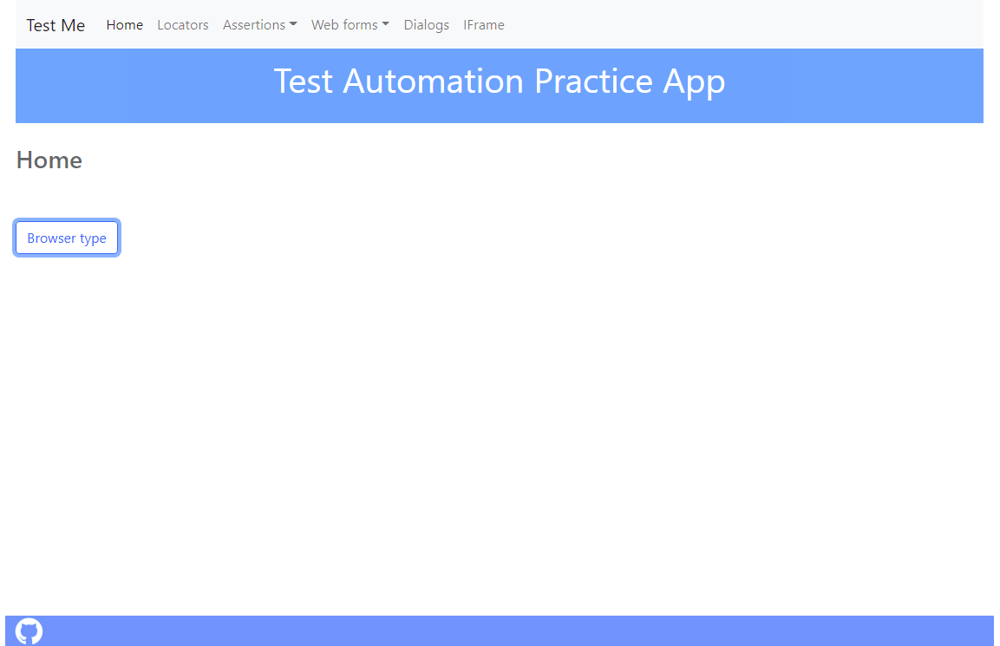
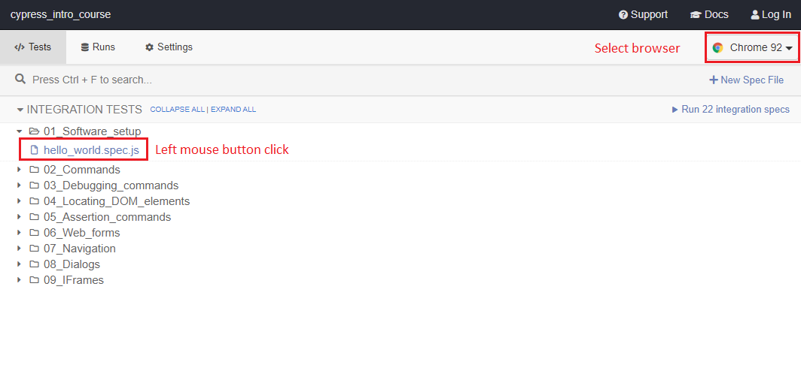
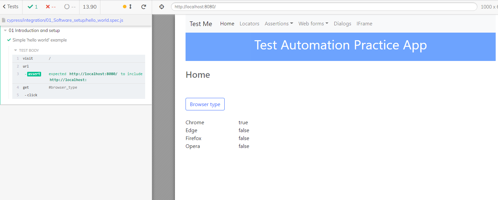

# Introduction

<br/>

The files in this repository, are for an introductory course to the **Cypress** test automation tool

* https://cypress.io

<br/>

See the accompanying YouTube presentations from this YouTube channel:

* https://www.youtube.com/channel/UC1x4XB4_ba_m18qGPiPrmLg

<br/>

The files comprise:

* A Test Web App, that is intended to be run on your local computer (localhost)
* Demo Cypress test spec files that use the Test Web App

<br/><br/>

# Installation


## Install Node.js

From https://nodejs.org follow the instructions to install either the: 

* “LTS” version  or 
* “Current” version

If in doubt, choose the “LTS” version

Take the installation defaults, unless you have a reason not to

<br/>

## Install Visual Studio Code

A code editor is required to create and edit the test script and other files

Unless you already have a code editor you want to use, download and install 
Visual Studio Code from:

* https://code.visualstudio.com/


<br/><br/>

# Getting the project files from GitHub

Either clone or download a ZIP archive of these project files (see the "Code" button)

<br/><br/>

# Install npm packages

Once you have the project files, start a command line terminal in the project files directory, and run the the following command:

<br/>

    npm install

<br/>

This will install the required npm packages - including Cypress

<br/><br/>

# Test Web App

The project files include a Test Web App that:

* Is intended to be run on your computer
* Allows you to run the Cypress test spec files against it
* **Is for test automation practice only, and is not meant for any other use**


<br/><br/>

# Configure Test Web App port (if needed)

<br/>

By default, the Test Web App runs on PORT 8080

If this port conflicts with another application you are running - you can change it 

To change the port - edit the file:

    cypress.json 
    
    Located at the top level, of the project files directory


* Stop the Test Web App if it is running
* Edit the port number at the end of the entry for baseUrl (here shown as 8080):

    ```
    {
        "baseUrl": "http://localhost:8080"
    }
    ```

* The Test Web App should now use the new port number when re-started


<br/><br/>

# Running the Test Web App

The Test Web App can be run in two ways:

* The preferred way is to install the node.js package pm2 globally, and running the Test Web App with it
* An alternative is to use another command line terminal, just for running the Test Web App


<br/>

## Run with pm2

From the command line prompt, in the project files directory, install the pm2 node.js package **globally**:

<br/>

    npm i pm2 -g

<br/>

You should now be able to start the Test Web App, by the command:

    pm2 start test_web_app.js

<br/>

Check you can now access the Test Web App by:

* Starting a web browser
* Accessing the following URL (For the default port 8080)

<br>

    http://localhost:8080 


<br/>



<br/>

You should also be able to stop the Test Web App, by the command:

    pm2 stop test_web_app.js

<br/>

…  and get the status of the Test Web App with:

    pm2 status

<br/>

## Run with node

Alternatively - if **you can’t use the pm2:** 

* Start another command line terminal, 
* Change into the project files directory,
* Run the Test Web App directly with node:


<br/>

    node test_web_app.js

<br/>

To stop the Test Web App just issue a **Ctrl-C**  command sequence


<br/><br/>

# Run a Cypress test spec

<br/>

# Start the Cypress test runner

* From the project files directory - start the **Cypress test runner**:


<br/>

    npm start

<br/>

* The Cypress test runner should now open, and display the available test spec files

* Select a test spec file by doing a **left-mouse-button-click** on it:

<br/>



<br/>

The Cypress test runner opens the test spec file in the selected web browser, and runs it

* The command log on the left shows the Cypress commands executed

* The browser view on the right - shows the Test Web App in the selected browser

<br/>


